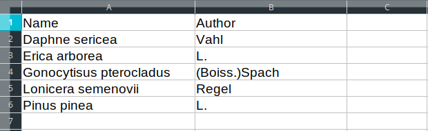

# TreeSearch
TreeSearch is a synonym-aware location search tool for tree species. For a given species name it uses publicly
available online data bases, namely [Plants of the World online](plantsoftheworldonline.org) and
[GlobalTreeSearch](https://www.bgci.org/global_tree_search.php), to search for known locations of all available
synonyms.


# Installation
## Setting up Python 3
TreeSearch requires Python 3, which you can get from [Python.org](https://www.python.org/downloads/), if it is not
already installed on your system. You can find out by typing
```bash
python3 --version
```
in bash (Linux and Mac) or the _Windows PowerShell_ or Command Shell _cmd_ (from now on all referred to as _terminal_).
One of two things should happen:
1) This gives an error like _"Command not found"_. Try again, but with `python` instead of `python3` (leave out the _3_).
    1) The error persists. You need to install Python 3.
    2) It reports a Python version less than 3. You need to install Python 3.
    3) It reports a Python version of at least 3.0. Your good to go, but **have to substitute `python3` by `python` in all
    other commands** described in this document.
2) It reports some version information like `Python 3.7.6`. Your good to go.


## Installing dependencies
After downloading and extracting the code to, say, _Downloads/treesearch_, use
```bash
cd Downloads/treesearch
```
in your terminal to change into that directory and execute following
commands from there. Alternatively, some file managers let you open a directory in the terminal by right clicking it 
(while holding Shift on Windows) and then selecting an entry from the context menu like _"Open in terminal"_, 
_"Open command window here."_, or _"Open Windows PowerShell window here"_.

Then, to install all dependencies with pip, type
```bash
python3 -m pip install -r requirements.txt
```
If this gives an error like _"File not found"_, make sure that you executed the command from within the extracted TreeSearch
directory. This should tell you the `pwd` command or `cd` on Windows.

Once pip finished downloading and installing the dependencies, you should be able to run TreeSearch by typing
```bash
python3 -m treesearch.py -h
```
which will show you instructions on how to use it (as the next section of this document does).


# Usage
To search for locations of the stone pine (*Pinus pinea*, described by L.), for example, simply type
```bash
python3 -m treesearch.py Pinus pinea L.
```

It is also possible to write the results to file in CSV format with the `-o` (or `--output`) flag:
```bash
python3 -m treesearch.py Pinus pinea L. -o output_file.csv
```

TreeSearch can also operate in batch mode by accepting a CSV file (comma ',' as field separator) with
multiple species names as input via the `-i` (or `--input`) flag:
```bash
python3 -m treesearch.py -i input_file.csv -o output_file.csv
```
This input file must (at least) contain a column *"Name"*, and a column *"Author"*. All additional columns are
preserved and ignored.

#### Example CSV file
Using this CSV file as input: 



TreeSearch is able to find locations for 3/5 species and yields the following file:


# Contact and bug reports
You can contact the author via e-mail at <limsande(at)yahoo dot com>. Feature suggestions and feedback of any
kind are very appreciated.

To file a bug report, please use this project's [issue tracker](https://github.com/Limsande/TreeSearch/issues).

